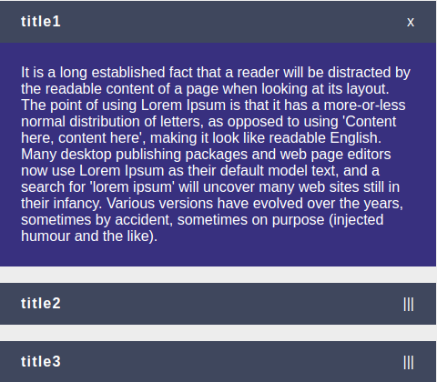

<h3 align="center">
  <p> Accordion </P>
</h3>


<p align="center">
   
</p>

### :computer: How To Run
 * Primeiro instale as dependencias:
 ```bash
 yarn ou npm install
 ```

### :computer: Scripts de inicialização:
  * Inicie a aplicação em modo desenvolvimento!
 ```bash
yarn start ou npm start
 ```
 * Abra [http://localhost:3000](http://localhost:3000) para vizualizar em seu navegador